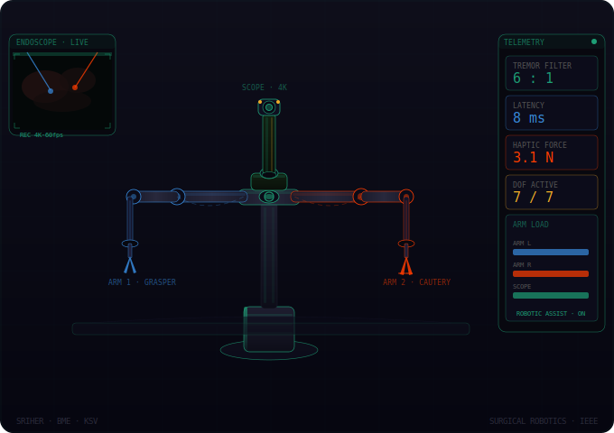
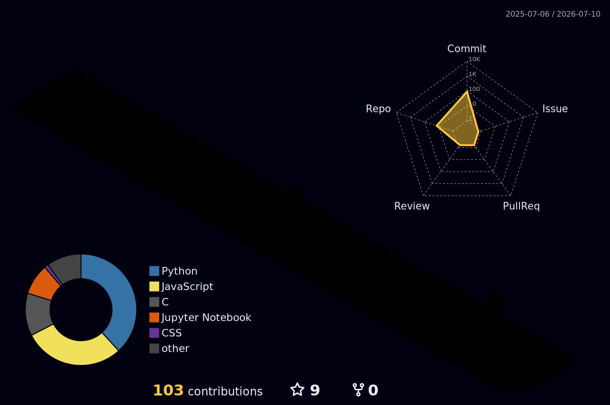

<!-- ╔══════════════════════════════════════════════════════════╗ -->
<!-- ║         KETHAN SAI VUPPALAPATI — GitHub Profile          ║ -->
<!-- ╚══════════════════════════════════════════════════════════╝ -->

<!-- ═══════════════════════════════════════════════════════════
     1. SURGICAL ROBOT BANNER
     Save your animated SVG as assets/surgical_robot.svg in this repo
     Then uncomment the line below and delete the placeholder
════════════════════════════════════════════════════════════ -->

<p align="center">
  
</p>

---

<!-- ═══════════════════════════════════════════════════════════
     2. TYPING SVG — cycles through your research areas
     Customize the lines= parameter with your own text
════════════════════════════════════════════════════════════ -->

<p align="center">
  <a href="https://git.io/typing-svg">
    
  </a>
</p>

<p align="center">
  
  &nbsp;
  <a href="https://github.com/KethanSaiV?tab=followers">
    
  </a>
  &nbsp;
  
  &nbsp;
  
</p>

---

<!-- ═══════════════════════════════════════════════════════════
     3. ABOUT ME
════════════════════════════════════════════════════════════ -->

```python
kethan = {
    "name"       : "Kethan Sai Vuppalapati",
    "degree"     : "B.E. Biomedical Engineering — SRIHER '26",
    "research"   : [
        "Lumbar foraminal stenosis grading (ConvNeXt V2 + Grad-CAM)",
        "CT–MRI cranial registration (SimpleITK, CPTAC-GBM)",
        "Needle path planning for CT-guided liver ablation",
        "Surgical robotics & image-guided interventions",
    ],
    "stack"      : ["PyTorch", "SimpleITK", "3D Slicer", "Streamlit", "OpenCV"],
    "publishing" : "IEEE WiSPNET 2026 + 3 papers in prep",
    "applying"   : "DAAD-WISE 2025 research fellowship",
    "contact"    : "github.com/KethanSaiV",
}
```

---

<!-- ═══════════════════════════════════════════════════════════
     4. GITHUB STATS + TOP LANGUAGES
     Replace KethanSaiV with your exact GitHub username if different
════════════════════════════════════════════════════════════ -->

<p align="center">
  
  &nbsp;&nbsp;
  
</p>

<!-- Streak stats -->
<p align="center">
  
</p>

---

<!-- ═══════════════════════════════════════════════════════════
     5. 3D CONTRIBUTION CALENDAR
     Setup: add the workflow below, then reference the output here.

     Workflow file → .github/workflows/3d-contrib.yml
     ─────────────────────────────────────────────────
     name: 3D Contribution Graph
     on:
       schedule:
         - cron: "0 18 * * *"
       workflow_dispatch:
     jobs:
       build:
         runs-on: ubuntu-latest
         steps:
           - uses: actions/checkout@v3
           - uses: yoshi389111/github-profile-3d-contrib@0.7.1
             env:
               GITHUB_TOKEN: ${{ secrets.GITHUB_TOKEN }}
               USERNAME: KethanSaiV
           - run: |
               git config user.name github-actions
               git config user.email github-actions@github.com
               git add -A
               git commit -m "Update 3D contrib graph"
               git push
════════════════════════════════════════════════════════════ -->

<p align="center">
  
</p>

---

<!-- ═══════════════════════════════════════════════════════════
     6. PINNED PROJECTS
════════════════════════════════════════════════════════════ -->

### 🔬 Research projects

| Project | Description | Stack |
|---|---|---|
| [lumbar-foraminal-stenosis-grader](https://github.com/KethanSaiV/lumbar-foraminal-stenosis-grader) | ConvNeXt V2 pipeline for automated MRI stenosis grading. Ordinal loss + Grad-CAM + Streamlit UI | PyTorch · OpenCV · Streamlit |
| [ct-mri-cranial-registration](https://github.com/KethanSaiV/ct-mri-cranial-registration) | Dual-mode 3D rigid registration framework on CPTAC-GBM dataset | SimpleITK · Python |
| [Path-Planning-for-liver-Ablation](https://github.com/KethanSaiV/Path-Planning-for-liver-Ablation) | Collision-aware needle path planning for CT-guided liver tumour ablation | Python · NumPy |

---

<!-- ═══════════════════════════════════════════════════════════
     7. SKILLS BADGES
════════════════════════════════════════════════════════════ -->

<p align="center">
  
  
  
  
  
  
  
  
  
</p>

---

<!-- ═══════════════════════════════════════════════════════════
     8. CONTRIBUTION SNAKE
     Setup: add the workflow below, run it once manually,
     then the snake auto-updates daily from the output branch.

     Workflow file → .github/workflows/snake.yml
     ─────────────────────────────────────────────────
     name: Generate Snake
     on:
       schedule:
         - cron: "0 0 * * *"
       workflow_dispatch:
     jobs:
       generate:
         runs-on: ubuntu-latest
         steps:
           - uses: Platane/snk@v3
             with:
               github_user_name: KethanSaiV
               outputs: |
                 dist/github-snake.svg
                 dist/github-snake-dark.svg?palette=github-dark
           - uses: crazy-max/ghaction-github-pages@v3
             with:
               target_branch: output
               build_dir: dist
             env:
               GITHUB_TOKEN: ${{ secrets.GITHUB_TOKEN }}
════════════════════════════════════════════════════════════ -->

<picture>
  <source
    media="(prefers-color-scheme: dark)"
    srcset="https://raw.githubusercontent.com/KethanSaiV/KethanSaiV/output/github-snake-dark.svg"
  />
  <source
    media="(prefers-color-scheme: light)"
    srcset="https://raw.githubusercontent.com/KethanSaiV/KethanSaiV/output/github-snake.svg"
  />
  
</picture>

---

<p align="center">
  <sub>
    Built with PyTorch · SimpleITK · Streamlit · lots of MRI scans
    &nbsp;·&nbsp;
    Chennai, India 🇮🇳
  </sub>
</p>
